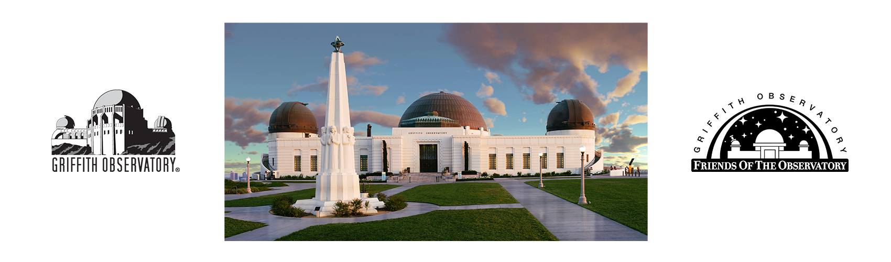
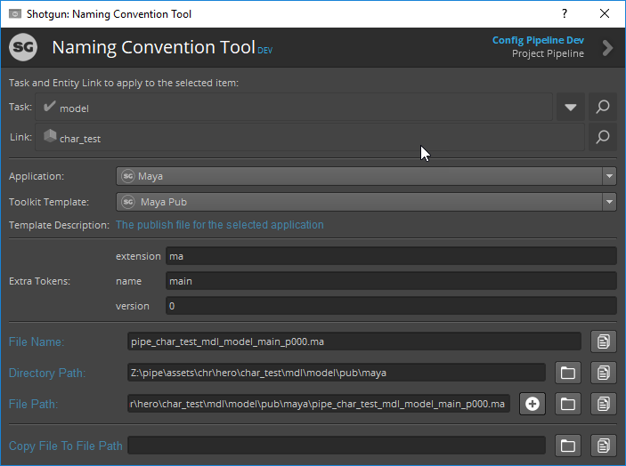

# Naming Convention App for Shotgun Toolkit

#### Griffith Observatory and Friends of the Observatory's Satellite Studio is proud to share the Tookit Naming Convention app that was developed for our new planetarium show Signs of Life, premiering in May 2020 at Griffith Observatory, Los Angeles
#### Astronomically yours!
http://www.griffithobservatory.org/
***

##### The Naming Convention Toolkit App provides a convenient and easy way for artists to work with the studio defined Toolkit naming conventions and directory structures.
##### This is particularly useful for DCC applications that don't have Toolkit integration but need to have files put into the proper directory and follow a certain naming convention.
##### The "Copy File to File Path" feature allows the artist to copy a single file to the "File Path" defined above. Image sequences are not currently supported.
##### It can also be useful as a stop gap tool while the pipeline is being built out but production is moving forward.

##### Feel free to reach out to me with any questions or use case issues.

##### Cheers,
##### Scott Ballard
* scott@scottballard.net
* https://www.linkedin.com/in/scottballard/
***
## Using the Naming Convention App

#### Step 1 - Select Shotgun Task
Using the Toolkit context widget, select the Shotgun Task you are working with that you want to create the associated file or directory
#### Step 2 - Select Application
Select the DCC application you are working with. When you do, Toolkit will register the selected context and application.

#### Step 3 - Select Toolkit Template
Select the associated Toolkit template. The description (below) might be helpful to know which template to use
#### Step 4 - Toolkit Template Description
This field may provide a further description of the Toolkit template selected above and how to use it
#### Step 5 - Toolkit Template Tokens
* Some Toolkit templates require extra token data that can be changed by the artist. Default values are usually provided.
The description above may provide additional information about the tokens
* The artist may need to provide additional values for the extra tokens
#### Step 6 - File Name
* The basename of the file derived from the Toolkit template
#### Step 7 - Directory Path
* The directory derived from the selected Toolkit template
#### Step 8 - File Path
* The full file path derived from the selected Toolkit template
#### Step 9 - Copy File to File Path
* Use this to copy a file into the same file path that is defined in the "File Path" above.
* Drag & Drop a file onto the widget or use the file browser button to the right.
#### Step 10 - Copy File Name
* Button will copy the "File Name"
#### Step 11 - File Browse / Copy Directory Path
* "Browse" button (first) will open a File Explorer or Finder window to the "Directory Path"
* "Copy" button (second) will copy the "Directory Path"
#### Step 12 - Copy File to File Path
* "Plus" button (first) will create the "File Path" on disk 
* "Browse" button (second) will open a File Explorer or Finder window to the "File Path"
* "Copy" button (second) will copy the "File Path"
#### Step 13 - Copy File to File Path
* "Browse" button (first) will open a File selection dialog to select the file you want to copy

***
## Installation
If you want to get up and running quickly, follow these simple steps:

## Optional Configuration Fields
* Shotgun Toolkit itself does not provide a method of defining descriptions for template definitions, that would be useful
for artists. The Naming Convention tool allows regular expressions to be defined and associated descriptions, which can
be used to define descriptions for those template entries.
